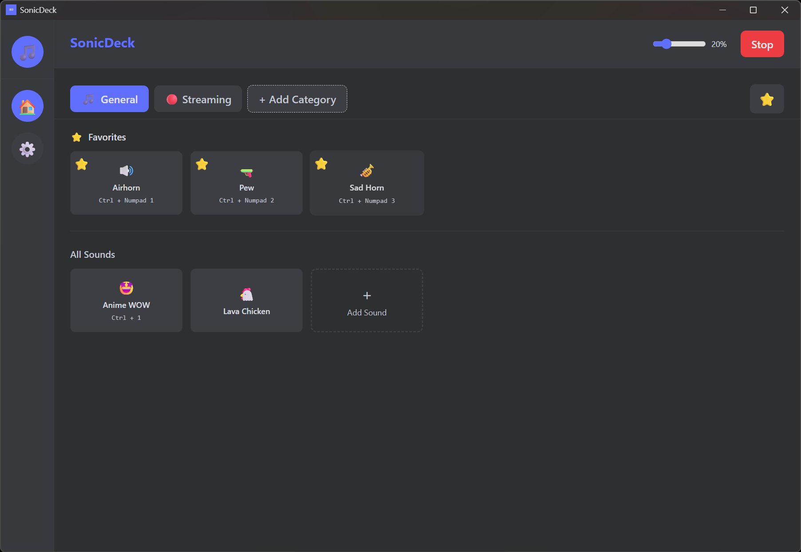
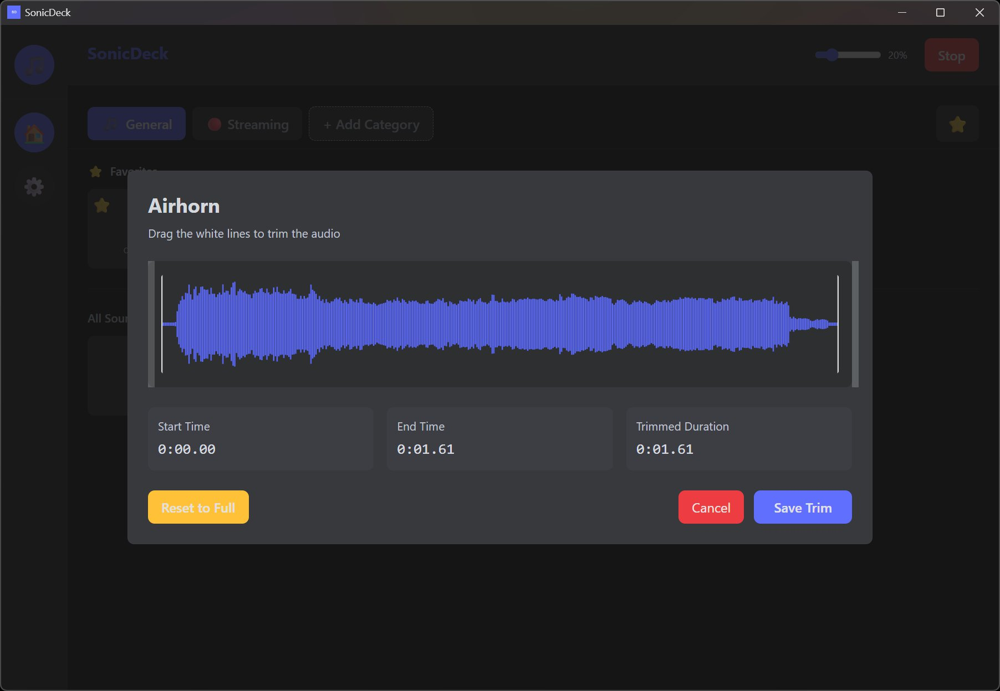
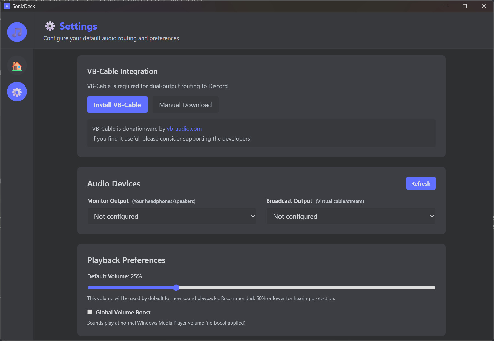
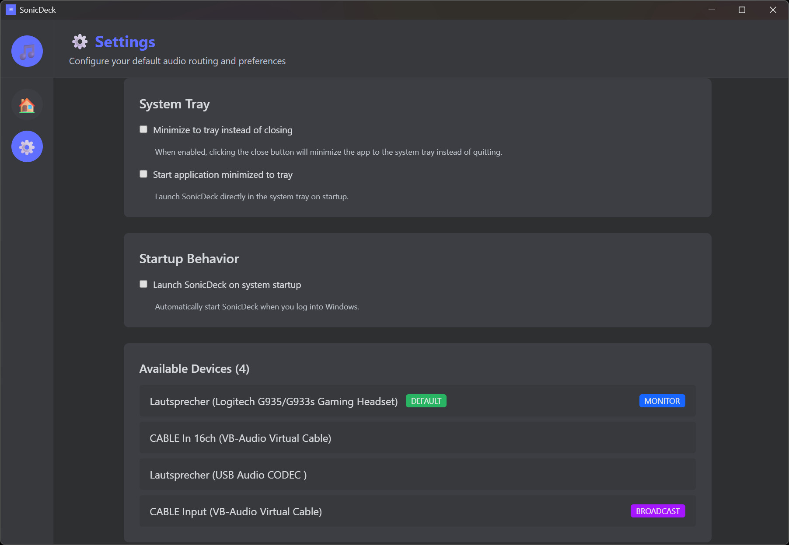
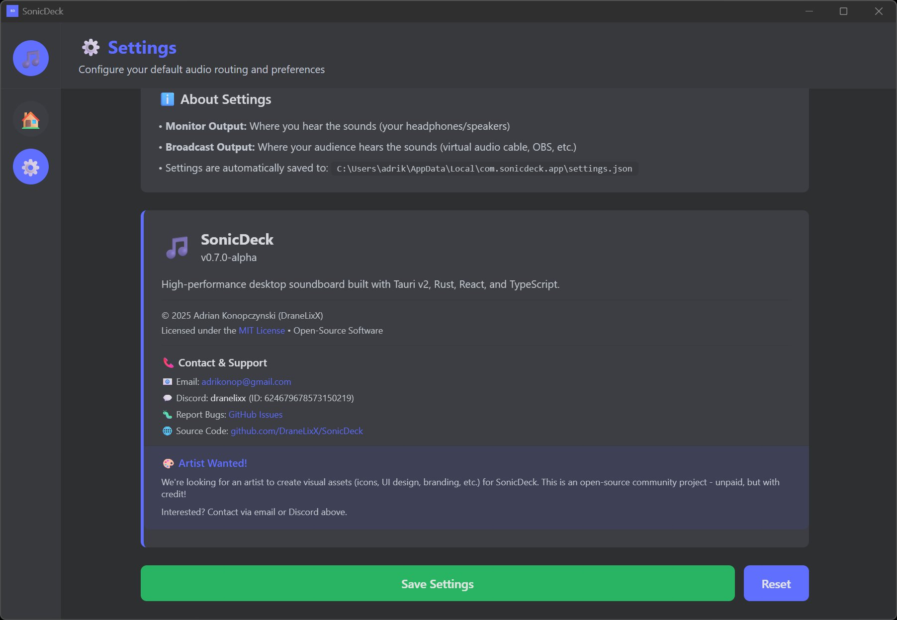
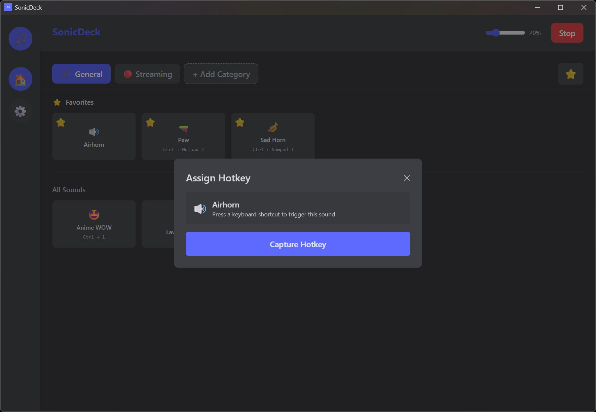
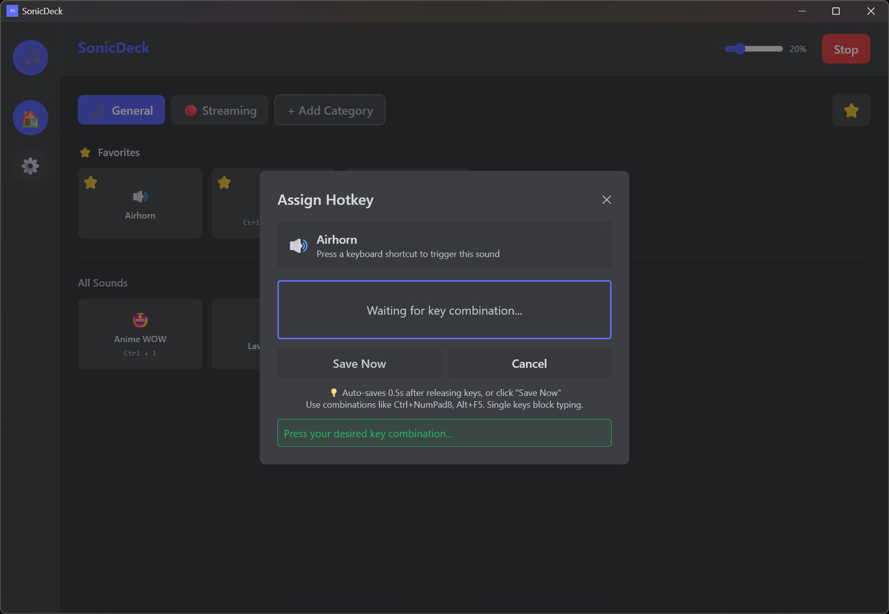
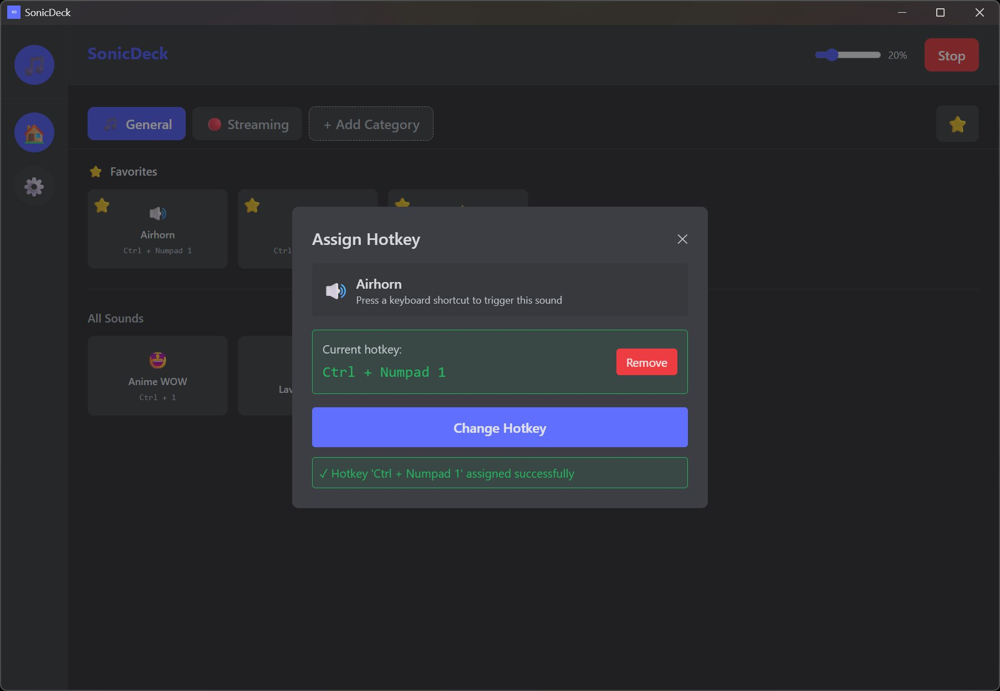
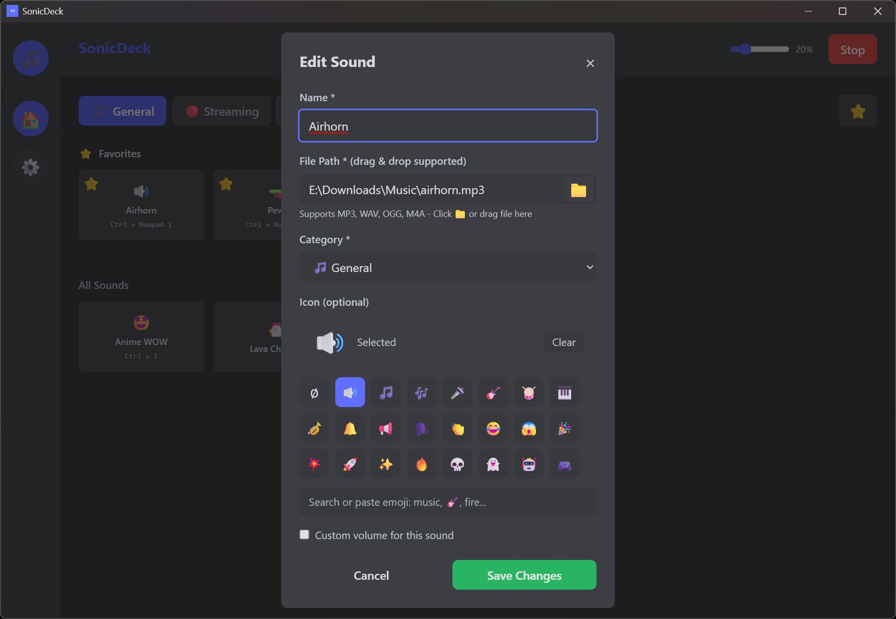

# SonicDeck 🎵

**High-performance desktop soundboard application built with Tauri v2, Rust, React, and TypeScript.**

Designed for gamers, streamers, and content creators who need professional audio routing with minimal latency. SonicDeck features a sleek, Discord-inspired dark theme and powerful audio management tools.

[](https://opensource.org/licenses/MIT)
[](https://github.com/DraneLixX/SonicDeck/releases)
[](https://github.com/DraneLixX/SonicDeck)

> **Status:** Currently in beta testing - [Download Latest Release](https://github.com/DraneLixX/SonicDeck/releases)

---

## 📸 Screenshots

### Main Dashboard

*Clean, Discord-inspired dark theme with organized sound categories and waveform visualization*

### Audio Trimming & Waveform Editor

*Non-destructive audio trimming with real-time waveform preview and precise controls*

### Settings & Configuration
<details>
<summary>Click to view all settings panels</summary>


*Audio device configuration with dual-output routing*


*Playback settings and system tray integration*


*App information and external links*

</details>

### Hotkey Assignment
<details>
<summary>Click to view hotkey assignment flow</summary>


*Assign global hotkeys to sounds*


*Press any key combination to assign*


*Hotkey successfully assigned and saved*

</details>

### Sound Editing

*Edit sound properties: name, icon, category, and volume*

---

## ✨ Features

### 🎧 Dual-Audio Routing
Play sounds to two separate audio devices simultaneously (e.g., headphones + virtual audio cable for streaming).

### 🎛️ Sound Library Management
- **Category Organization**: Organize sounds with custom categories
- **Drag & Drop Import**: Drop MP3, WAV, OGG, or M4A/AAC files directly into the app
- **Favorites System**: Star your most-used sounds for quick access
- **Custom Icons**: Assign emojis to sounds with built-in picker
- **Per-Sound Volume**: Individual volume control for each sound

### 📊 Audio Caching & Waveform Visualization
- **LRU Memory Cache**: 500MB cache for instant repeated playback
- **Real-time Waveform Display**: High-DPI canvas rendering with playback progress
- **Interactive Trim Editor**: Non-destructive audio trimming with visual feedback
- **Trim-aware Playback**: Audio automatically starts/ends at trimmed boundaries

### 🎨 Modern UI/UX
- Discord-inspired dark theme
- Smooth animations and transitions
- Toast notifications for user feedback
- Responsive layout with drag & drop support

### ⚡ Performance
- **Low-Latency Audio Engine**: Fixed 256-sample buffer size for minimal audio delay
- **Seamless Sound Restart**: Instant retriggering without audio gaps or clicks
- **Rust Backend**: Built with `cpal` + `symphonia` for high-performance audio processing
- **Thread-per-playback**: Parallel sound playback without blocking
- **Background Decoding**: No UI freezes, even with large files
- **Optimized React Components**: Memoization prevents unnecessary re-renders

### ⌨️ Global Hotkeys & System Integration
- **Global Hotkeys**: Trigger sounds from anywhere with customizable keyboard shortcuts
- **System Tray**: Minimize to tray with quick access menu
- **Autostart**: Optional launch on system boot
- **Start Minimized**: Begin in system tray for unobtrusive startup

## 🗺️ Development Status

- ✅ **Phase 1**: Audio Foundation (Dual-output engine, device enumeration)
- ✅ **Phase 2**: Settings & UI (Device configuration, navigation)
- ✅ **Phase 3**: Sound Library Management (Categories, favorites, drag & drop)
- ✅ **Phase 4**: Audio Caching, Waveform Visualization & Trim Editor
- ✅ **Phase 5**: System Integration (Global hotkeys, system tray, autostart)
- 🚀 **Current**: Beta testing, bug fixes, polish, and community feedback

### Planned Features
- **Auto-Updater** – Seamless updates without manual reinstallation
- **Import/Export** – Library migration via JSON/ZIP
- **OBS Integration** – Scene-based sound triggers via WebSocket
- **Audio Effects & Voice Changer** – EQ, Reverb, Pitch Shifting
- **Device Profiles & Auto-Switch** – Save device setups, auto-reconnect on change
- **Mobile Web-Remote** – Control via smartphone browser (no app install needed)
- **Game-Aware Profiles** – Auto-switch profiles per game

## 🐛 Beta Testing & Logging

**Log Files for Bug Reports:**
- Location: `%LOCALAPPDATA%\com.sonicdeck.app\logs\`
- Format: `sonicdeck.YYYY-MM-DD.log` (e.g., `sonicdeck.2025-12-28.log`)
- Daily rotation (last 7 days kept automatically)
- Contains timestamps, thread IDs, errors, and detailed operation logs

**Debug Mode for Detailed Logs:**
To help diagnose issues, run SonicDeck with the `--debug` flag:
- **Shortcut Method**: Right-click SonicDeck shortcut → Properties → Add `--debug` to Target field after `.exe`
- **Command Line**: `SonicDeck.exe --debug`
- **Result**: Enables detailed debug-level logging (device timings, cache operations, stream creation, etc.)

**For Testers:** If you encounter bugs, please:
1. Run SonicDeck with `--debug` flag to capture detailed logs
2. Reproduce the issue
3. Include the log file from `%LOCALAPPDATA%\com.sonicdeck.app\logs\` in your bug report

See `docs/testing/TESTING_GUIDE_EN.html` for detailed instructions.

## 🎨 Looking for an Artist!

**I'm searching for a talented artist to create visual assets for SonicDeck!**

Needed:
- App branding (logo, icons, banners)
- UI/UX design elements
- Social media graphics
- Presentation materials
- Marketing visuals
- Anything else to enhance the project's visual identity

**This is an open-source community project - contributions are unpaid.**  
If you're passionate about design and want to contribute to an open-source project, please reach out:
- 📧 Email: adrikonop@gmail.com
- 💬 Discord: dranelixx (ID: 624679678573150219)

---

## 📥 Installation (For Users)

> **Note**: SonicDeck is currently in **beta testing**. Download the latest release and help us improve!

### Windows Installation

1. **Download the latest release:**
   - Go to [Releases](https://github.com/DraneLixX/SonicDeck/releases)
   - Download `SonicDeck_X.X.X_x64-setup.exe` (NSIS installer) or `SonicDeck_X.X.X_x64_en-US.msi` (MSI installer)

2. **Install:**
   - Run the installer
   - Follow the installation wizard
   - Launch SonicDeck from Start Menu or Desktop shortcut

3. **Enable Debug Mode (for bug reports):**
   - Right-click SonicDeck shortcut → Properties
   - In "Target" field, add `--debug` after `.exe`
   - Example: `"C:\Program Files\SonicDeck\SonicDeck.exe" --debug`
   - This enables detailed logging for troubleshooting

### First Launch
- Configure your audio devices in Settings
- Import sounds via drag & drop
- Assign hotkeys to your favorite sounds
- See [Testing Guide](docs/testing/TESTING_GUIDE_EN.html) for detailed setup

---

## 🛠️ Development Setup

> **For contributors:** Follow these steps to set up your development environment.

### Prerequisites

- [Node.js](https://nodejs.org/en/)
- [Yarn Package Manager](https://yarnpkg.com/)
- [Rust](https://www.rust-lang.org/tools/install)
- [Tauri Prerequisites](https://tauri.app/v1/guides/getting-started/prerequisites)

### Installation & Running

1. **Clone the repository:**

   ```sh
   git clone https://github.com/DraneLixX/SonicDeck.git
   cd SonicDeck
   ```

2. **Install frontend dependencies:**

   ```sh
   yarn install
   ```

3. **Run the development server:**

   ```sh
   yarn tauri dev
   ```

## 🤝 Contributing

Contributions are welcome! Whether you're fixing bugs, adding features, testing, or creating visual assets - we appreciate your help!

**Ways to contribute:**
- 🐛 Report bugs with detailed logs
- 🧪 Beta test and provide feedback
- 🎨 Create visual assets (we're looking for an artist!)
- 💻 Submit code improvements
- 📝 Improve documentation

**Please read [CONTRIBUTING.md](CONTRIBUTING.md) for detailed guidelines** on:
- Development workflow (Git Flow)
- Code style and conventions
- Commit message format
- Testing procedures
- Community guidelines

## 📄 License

This project is licensed under the **MIT License** - see the [LICENSE](LICENSE) file for details.

### Copyright Notice

```
Copyright (c) 2025 Adrian Konopczynski (DraneLixX)
SonicDeck - High-Performance Desktop Soundboard
```

**What this means:**
- ✅ You can use, modify, and distribute this software freely
- ✅ You can use it for commercial purposes
- ✅ You must include the copyright notice and license in any copies
- ⚠️ The software is provided "as-is" without warranty
- 💡 Future paid features may be offered under a separate commercial license

---

## 📞 Contact & Support

**Developer:** Adrian Konopczynski (DraneLixX)
- 📧 Email: adrikonop@gmail.com
- 💬 Discord: dranelixx (ID: 624679678573150219)
- 🐛 GitHub Issues: [Report a Bug](https://github.com/DraneLixX/SonicDeck/issues)
- 🌐 Repository: [github.com/DraneLixX/SonicDeck](https://github.com/DraneLixX/SonicDeck)

---

Built with ❤️ by [Adrian Konopczynski (DraneLixX)](https://github.com/DraneLixX)
